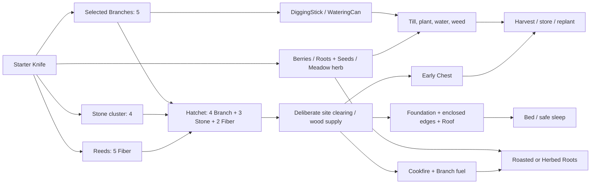
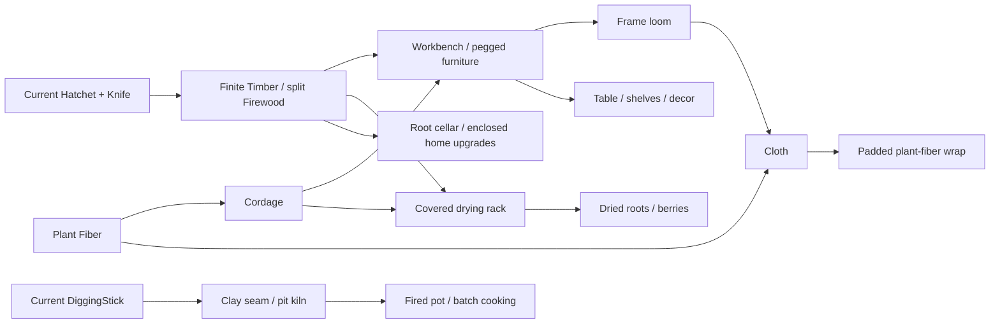

# Crafting progression: from a knife to a winter-ready home

**Design/data handoff, not a runtime feature.** `catalog.json` is not loaded by
the game. **Current** means observed in source at
`c933270622946404e792ce0e2e4bc117912d4f19`, not newly playtested here.
**Next** is the proposed smallest material-processing extension. **Later** is
an implementable direction with explicitly missing systems, not an unlockable
menu. All new quantities, yields, time estimates and patch densities are
provisional design assumptions, not external scientific facts or play evidence.

Jenny starts in spring with worn clothes and a knife, chooses her own site in
lush woodland, and makes a home. Standing biomass can be abundant without
turning every stick and scenic plant into a pickup. The first useful upgrade
is a hatchet, not a research point or permission from a villager.

## What exists, and what this lane owns

The current enums, exact ordinal IDs and transactions are preserved in the
catalog. `Item::Branch` remains ID1, `Stone` ID2 and `Fiber` ID3. The display
name of `Flowers` (ID6) is **Meadow herb**, not a promise that every decorative
flower is edible. `Knife` ID0 starts owned; LeatherShoes are starter-only.
Proposed entities have **null runtime IDs**; design keys are not enum values.

Reuse: `HomesteadSimulation.h/.cpp` already supplies inventory transactions,
recipe/build costs, garden growth, fuel, wardrobes, storage and needs.
`HomesteadController.cpp` supplies additional placement/crafting time.
`UI/HomesteadMenuInventory.cpp` supplies garment transactions.
`docs/game-plan.md` supplies the product constraints, while
`docs/research/environment-assets/resource-palette-20260921.md` and
`docs/asset-credits.md` document admitted CC0 branches, shrubs, small firs,
flowers, grass and rocks. Reuse these systems and assets; no plugin, framework,
new marketplace acquisition or scientific species claim is needed.

This lane owns only this directory, `Scripts/Validate-CraftingProgression.ps1`
and `openspec/changes/define-crafting-progression`. Main owns world/controller,
native integration and playtests; the authority lane owns Simulation/save;
the generator owns chunk/seed/version and stable identities.

**Important boundary:** the source baseline has `ResourceKind::Sapling`, not
the new generated mature-tree resource. Its ready yield is 8 Branch + 2 Fiber.
Using that return for mature-tree clearance is an **interim,
integration-dependent world contract**, not verified mature-tree gameplay or a
settled economy. The opening example below uses seven current Sapling clears
as an arithmetic surrogate, never proof that seven mature trees are necessary
or sufficient in the new world.

## Bounded first playable arc

1. Notice three reachable useful sources: one branch bundle, one stone cluster,
   one fiber stand. With the starter knife these give 5 Branch, 4 Stone,
   5 Fiber. Craft the hatchet for 4/3/2; retain the knife.
2. Choose a site, deliberately clear the occupying stems/trees, and work nearby
   biomass. Build storage early. No hidden initial house clearing; tree removal
   must actually persist and reveal usable ground.
3. Build a small **two-cell enclosed shelter**, bed and chest in different
   furniture cells, and an outdoor cookfire. Fuel it and cook roots without a
   pot. The first meal need not wait for farming: berries are edible raw.
4. Make the digging stick and watering can; till two root plots and one berry
   plot from gathered planting stock. Water/weed for pleasure and faster growth.
   Harvests and storage, not compulsory village errands, lead into winter prep.



This is **availability order**, not a new locked research UI. The current
recipes are already visible; future learning can reveal a recipe after seeing
its material/tool, without XP levels. Inputs are consumed, tools/stations are
retained. Building requires valid nearby unoccupied cells; edges/roofs require
foundations. The graph does not replace enclosure, reach, maturity or fuel
expiry rules.

## Current units, recipes and needs

One game hour = **150 real seconds** at the current 60-minute day.
Simulation craft/gather/build/garment calls themselves advance **0 hours** and
charge **0 direct energy points**. Native recipe activation adds **0.05 game
hour** (7.5 real-second equivalent, not a seven-second progress bar), and
placement adds **0.1 hour** (15-second equivalent).
At the unchanged awake drain of 2 hunger and 2.4 energy/hour, these advances
cost 0.10/0.12 points per recipe and 0.20/0.24 per placed piece.
Walking and unpaused animations additionally consume normal world-clock time.
Menus/planning pause that clock. Garments have no equivalent extra time charge.
No durability, repair, crafting levels or per-action stamina costs exist.

| Current action (exact identifier) | Consumed input | Output | Retained prerequisite / reach | Native added hours |
|---|---|---|---|---:|
| `Recipe::Hatchet` (0) | 4 Branch, 3 Stone, 2 Fiber | 1 Hatchet | Knife; valid player location | 0.05 |
| `Recipe::DiggingStick` (1) | 3 Branch, 1 Stone | 1 DiggingStick | Knife | 0.05 |
| `Recipe::WateringCan` (2) | 3 Branch, 2 Fiber | 1 WateringCan | Knife | 0.05 |
| `Recipe::RoastedRoots` (3) | 2 Roots | 1 RoastedRoots | Fueled Fire within 450 cm; no pot/knife gate | 0.05 |
| `Recipe::HerbedRoots` (4) | 2 Roots, 1 Flowers | 1 HerbedRoots | Fueled Fire within 450 cm | 0.05 |
| `Piece::Foundation` (0) | 4 Branch, 2 Stone | 1 placed foundation | Clear valid cell within 700 cm | 0.10 |
| `Piece::Wall` (1) | 3 Branch, 1 Fiber | 1 placed wall edge | Foundation in same cell | 0.10 |
| `Piece::Doorway` (2) | 4 Branch, 1 Fiber | 1 entry edge | Foundation in same cell | 0.10 |
| `Piece::Roof` (3) | 4 Branch, 3 Fiber | 1 roof | Foundation in same cell | 0.10 |
| `Piece::Fire` (4) | 3 Branch, 4 Stone | 1 unlit cookfire | Clear cell within 700 cm | 0.10 |
| `Piece::Bed` (5) | 4 Branch, 4 Fiber | 1 bed | Separate furniture cell | 0.10 |
| `Piece::Chest` (6) | 5 Branch, 2 Fiber | 1 chest, 120 units | Separate furniture cell | 0.10 |
| `WearableDefinition::LinenTunic` (0) | 12 Fiber | 1 carried tunic | Knife; cosmetic | 0 |
| `WearableDefinition::LinenApron` (1) | 6 Fiber | 1 carried apron | Knife; cosmetic | 0 |
| `WearableDefinition::WovenFootwraps` (3) | 8 Fiber | 1 carried footwraps | Knife; cosmetic | 0 |
| `AddFuel` | 1 Branch | 4 fuel hours | Fire within 300 cm, maximum 48 hours | 0 |

`LeatherShoes` (wearable ID2) cannot be crafted. Equipped starter tunic/shoes
use no pack units; a carried garment uses one. All item quantities count one
unit each: **120 is neither kilograms nor stack slots**. A whole tree is not a
single free-weight pocket object.

Current berries restore 12 hunger, roasted roots 28, herbed roots 38, capped at
100. Raw roots are not edible. Food has no spoilage. Awake drain is 2 hunger
and 2.4 energy/hour; sleep drains 1.3 hunger and restores 10 energy/hour.
Eight hours' sleep needs a bed within 300 cm and advances the garden/fuel clock.
Night warmth is -6/hour before modifiers; shelter raises the rate to at least
+1/hour and a nearby fire to at least +6/hour. These are existing rules,
**not newly balanced winter insulation**. Seasons are named on the 14-day
calendar but do not currently suppress winter plant growth or increase cold.

## Materials: source, depletion and geographic role

All current non-Sapling wild harvesting requires the **Knife** within
**300 cm**. This includes stone pickup and root harvest: more natural hand
pickup/digging prerequisites are a future change, not claimed implemented.
Saplings require the Hatchet. Harvest grants the full yield atomically or fails;
on full pack it must not consume readiness or discard overflow.
`Clear` permanently removes a source; it awards its ready yield only once.
Clearing during cooldown yields nothing, not a second harvest.

| Source / material | Exact current yield; renewal | Proposed role and variation, not current rules |
|---|---|---|
| `Branches` -> Branch | 5; 24 game hours | A few selected useful boughs/deadfall, proposed 3-5 units. Scattered scenic twigs are not handles or house timber. Future deliberate collection/pruning needs source/work state; rare litter/storm replenishment rather than endless daily piles. |
| `Stones` -> Stone | 4; 48 hours | Rocky bank/outcrop clusters, proposed 3-5. Select sound tool blanks visually within the same item type; guarantee usable stone, no rare-drop gate. Later excavation is finite per seam, not stone regrowth. |
| `Reeds` -> Fiber | 5; 24 hours | Cut/bundle bank fibers, proposed 4-6. Additional retting/spinning can be batch state later; do not add inventory clutter for every step. Fiber comes primarily from plants, not arbitrary mature-tree rewards. |
| `Sapling` -> Branch + Fiber | 8 + 2; 168 hours if harvested | Current small-stem abstraction. Permanent clearance never regrows; proposed small-wood yield 6-8 requires separate balance. Not a mature timber conversion. |
| `BerryBush` -> Berries | 5; 36 hours | Living fruiting understory at sunny edges, proposed 4-6. Picking leaves the bush. Later seasonal windows require a spring edible alternative before restricting berries. |
| `Roots` -> Roots + Seeds | 2 + 2; 48 hours | Moist loose-soil patch, proposed 2-3 Roots plus guaranteed planting stock. Digging animation/tool proposal must retain a viable first meal. Future winter dormancy is separate. |
| `Flowers` -> Flowers | 3; 24 hours | Readable meadow herb at sunny gaps, proposed 2-4. Optional food/dye/decor enrichment, not every flower species edible or a survival quota. |
| Stream -> Water | Fill to 6, not +6 every call; no depletion | WateringCan required, within 180 cm in X of `StreamX(y)` in current rules. Six carried Water units use six pack units. No thirst system. |
| Cultivated roots | 4 Roots + 2 Seeds per mature harvest | Plant costs 1 Seeds; theoretical minimum 30 growing hours, slower with imperfect moisture/weeds. Replant after harvest. |
| Cultivated berries | 6 Berries per mature harvest | Plant costs 1 Berries; theoretical minimum 42 growing hours. Bush remains planted, resets growth. |
| Proposed mature usable timber | Representative 6 Timber + 4 Branch; finite | Hatchet fell/limb/billet sequence, proposed Timber range 4-8 depending on selected stem size; **no Fiber**. Split 1 Timber into 4 Firewood. No automatic cooldown reset. |
| Proposed Clay | Representative 4, range 3-5 per dig | DiggingStick at identifiable exposed seam, 300 cm; suggested 8-16 total units/seam. Occasional finite deposit, not every wet cell. Later only. |
| Mushrooms, raw hides, bone | **No current IDs, recipes or yields** | Mushrooms need readable edible species/season rules, not arbitrary poison roulette. Scavenged hide/bone belong after MVP and before optional hunting. Neither is needed for the first food, cordage or clothing route. |

Tool/processed-item acquisition is fully specified in the recipe tables and
JSON: no other current ore, leather, rope, cloth or knife source is implied.
Knife replacement is a meaningful later resilience feature; the current
opening depends on keeping the starter knife, not crafting a knife with itself.

### Generator-facing availability, not global quotas

**Startup guarantee:** one ready 5-Branch source, one ready 4-Stone source and
one ready 5-Fiber source accessible without felling, with the current starter
Knife. Suggested search neighborhood is within a **40 m route envelope** of
arrival. Distance tests alone do not prove walkability, bank reach or camera
readability. Preserve only spawn safety, never a rectangular home clearing.
The three yields exceed the 4B/3S/2F hatchet demand; lowering yields requires
rerunning bootstrap, not increasing loose branch density by reflex.

**Representative habitat guidance:** 0-1 useful-wood sites per ordinary 24 m
chunk, with clustered exceptions; 0-2 stone clusters in rocky habitat;
2-4 berry/herb nodes or 2-3 root nodes in selected patches roughly 30-60 m
apart along suitable routes; 2-3 fiber nodes per stand roughly 20-40 m along
suitable banks. These are visual/balance starting points, not fixed universal
quotas. The generator's first source implementation uses its own fixed candidate
slots and a modest branch ceiling; its seed/version contract remains authoritative.

**Keep knobs separate:** habitat masks, stable candidates, identity and accepted
positions are generation concerns. Yield, processing time, depletion/renewal
and tool requirements are economy/authority concerns. Changing a tree's yield
must not relocate it or change its saved identity. More construction demand
should first motivate usable standing wood and processing yield, not a higher
count of visible fallen logs. Avoid spawning a copy of every resource species
in every chunk merely to satisfy the one example below.

## A leisurely opening: two excursions, not twenty log-fetch errands

Illustrative **two 3 m cells** in a 1x2 rectangle: two foundations, two roofs,
five outer walls and one doorway. Shared internal edge stays open.
Bed and chest occupy different cells; fire occupies a separate outdoor cell.
Root/berry plots are outside the building. A roof without enclosed edges does
not qualify as shelter. Do not assume all chosen sites require seven removals.

| Cumulative bill | Branch | Stone | Fiber |
|---|---:|---:|---:|
| Hatchet + DiggingStick + WateringCan | 10 | 4 | 4 |
| Two-cell shell | 35 | 4 | 12 |
| Bed + Chest + Fire | 12 | 4 | 6 |
| Three fuel additions = 12 hours | 3 | 0 | 0 |
| **Total** | **60** | **12** | **22** |

This does not include raw food: add **4 Roots + 2 Flowers** for two HerbedRoots,
**2 Seeds + 1 Berries** for planting, and a berry snack. Three wild-root gathers
produce 6 Roots + 6 Seeds; two berry gathers produce 10 Berries; one herb gather
produces 3 Flowers. These leave food/seed reserves, not just the exact next click.

The illustrative ready-source neighborhood is two Branches sites, three Stones,
two Reeds, seven distinct ready Saplings, three Roots, two BerryBush and one
Flowers: **20 source actions**. Construction supply is **66B/12S/24F**.
These are source quantities, not seed IDs or required nodes in every chunk.
In an integrated forest, mature-tree clearance must get its own confirmed
economy and play evidence; substituting an interim identical yield is arithmetic
compatibility only.

| Sequence (the JSON records every transaction) | Pack / storage consequence |
|---|---|
| First three gathers, then hatchet | Pack rises to 15, falls to 7; no hatchet/rope/knife loop. |
| Clear 3 ready stems, gather the other branch, 2 stones, reed, food patches | Peak **80/120** before remaining tool crafting. |
| Craft remaining tools; place Chest, 2 foundations and Fire; fuel 3 times; cook 2 meals | Consumes stock before another wood trip. Fire/cooking does not require a finished roof. |
| Store 2 Roots, 6 Seeds, 8 Berries, 1 Flowers | **17 stored**, **23 carried**. No output silently vanishes. |
| Second excursion: clear 4 distinct ready stems; return and finish shell/bed | Pack rises to 63, then falls to 16. |
| Take 2 Seeds; till/plant 2 root + 1 berry plots; fill empty can, water3; eat 1 berry + 1 meal | **16 carried**, **15 stored**. Nutrition is capped; snack timing may waste a few points. |

Final carried stock: four tools, 6 Branch, 2 Fiber, 1 HerbedRoots, 3 Water.
Chest: 2 Roots, 4 Seeds, 8 Berries, 1 Flowers.
Early cosmetics are optional: an apron needs another 6 Fiber, not a new
tech tier; the outfit is not a survival reward.

**Time/needs estimate, not a timed playtest:** allow 16 game hours awake,
including 1.30 hours for 13 placements and 0.25 for five crafts. That leaves
14.45 hours of ordinary world activity, about **36.1 real minutes**, plus
perhaps 6-12 paused minutes choosing a site, reading recipes and arranging
pieces. Eight-hour sleep completes the day without eight hours of real waiting.
Awake energy drops 38.4 points before sleep restores it. Hunger demand is
32 awake + 10.4 asleep = **42.4/day**, well within the two cooked meals and
berries obtained; eat before critical hunger, not only at the ledger's last
line. This is deliberately room for wandering and tending, not a claimed
speedrun or a requirement to finish the house in one sitting.

## Prewinter reserve using current arithmetic

Reserve for 14 days at 16 awake / 8 asleep:
**593.6 hunger points**. Twenty-four RoastedRoots supply **672**, an approximately
13% arithmetic margin if eaten without excessive cap waste. They consume
**48 Roots**, not 24. Herbs are optional. Budget **42 Branch** for a chosen
12 fire-hours/day = **168 hours**, not because current enclosed shelter needs
continuous fire. Current max48 fuel hours means refueling visits; never preload
the entire winter into one fire.

| Winter chest kit | Units |
|---|---:|
| 24 RoastedRoots | 24 |
| 42 Branch fuel | 42 |
| 12 Seeds reserve | 12 |
| 6 Fiber repair/expansion allowance (no tool-repair mechanic implied) | 6 |
| 4 Stone | 4 |
| **One chest used / capacity** | **88 / 120** |

Production example: **four root plots x three harvests = 48 Roots + 24 Seeds**,
with 12 Seeds invested in planting and 12 net new Seeds. The two opening root
plots need two additional tilled plots. Assume about **72 game hours per
tended crop cycle**, giving three cycles over nine days; this is not guaranteed
growth. Actual growth depends on moisture/weeds/rain, with a perfect-condition
lower bound of 30 hours. Four plots need at most four Water per watering pass;
one six-portion fill covers that pass. Missed tending slows growth rather than
killing the plants. Do not promise exactly one pass/day will achieve 72 hours.

The 24 cooked portions cost **1.2 native-added game hours** and must be made
beside an operating fire; allocate one additional Branch from autumn operating
stock if no fire is already lit. Six ready Sapling clears give 48 Branch and
12 Fiber, with 6 Branch + 6 Fiber left after the reserve; this is another
**current-rule surrogate**, not a mandate to fell six mature trees.
One stone gather supplies the 4 Stone reserve. **12 crop harvests, 12 plantings,
24 cooks, 6 ready clears, 1 stone gather**, plus actual watering/weeding/refill
visits and any site clearance: those tending trips are not hidden.

The separate stocking ledger traces two excursions **after crop production**:
garden harvest/cook/store, then wood/stone/store. It peaks at **80 carried**,
ends with 88 stored and 28 carried (four tools, 12 Seeds, 6 Branch, 6 Fiber).
The remaining seed surplus and material surplus are explicit. This is not a
claim that 48 raw Roots materialize instantly, that all 12 crops fit one garden
visit, or that only two outings prepare the entire season. Keep producing
ordinary autumn meals separately; do not eat the winter reserve while counting
it as still stored. A second chest helps sorting/wardrobe but is not forced by
the 88-unit reserve.

**Missing winter gameplay:** food currently never spoils, every source grows
year-round, cosmetic garments do not insulate, and seasonal weather has no
additional cold penalty. The budget is a supply target for the winter round,
not proof the current game implements preservation or a winter survival arc.

## Next: wood processing and meaningful household upgrades

The next **bounded production slice** should be finite tree processing plus
Timber, Cordage and Firewood, with one workbench/chest improvement demonstrated
in the existing building system. Do not implement all future tiers at once.
No change here retroactively alters Branch or the original hatchet recipe.

Proposed active times use game hours; direct energy remains **0** until a
deliberate work-cost change (normal awake drain still applies). Durability stays
unsupported. Source interactions use 300 cm, future stations should use the
existing 300 cm interaction convention, and new placed pieces should reuse
700 cm placement reach. Check station proximity on commit; a station in another
chunk must not satisfy a global unlock.

| Proposed next action | Inputs -> outputs | Tool / station; active hours |
|---|---|---|
| Twist binding | 2 Fiber -> 1 Cordage | Knife; 0.05 |
| Fell, limb, billet selected usable tree | finite tree -> 6 Timber + 4 Branch | Hatchet; 0.25 total across readable stages |
| Split fuel | 1 Timber -> 4 Firewood | Hatchet; 0.05 |
| Fuel fire | 1 Firewood -> 4 fuel hours | Existing Fire; 0 |
| Workbench | 6 Timber + 2 Cordage -> 1 bench | Hatchet + Knife; 0.20 |
| TimberFoundation | 4 Timber + 2 Stone -> 1 piece | Hatchet; 0.20 |
| TimberWall | 2 Timber + 1 Cordage -> 1 piece | Hatchet + TimberFoundation; 0.15 |
| TimberDoorway | 3 Timber + 1 Cordage -> 1 piece | Hatchet + TimberFoundation; 0.15 |
| ThatchedRoof | 2 Timber + 4 Fiber + 1 Cordage -> 1 piece | Knife + TimberFoundation; 0.15 |
| PeggedChest | 3 Timber + 1 Cordage -> 1 chest | Hatchet + Workbench; 0.15 |
| RaisedBed | 2 Timber + 4 Fiber + 1 Cordage -> 1 bed | Knife + Workbench; 0.15 |
| Covered DryingRack | 2 Timber + 2 Cordage -> 1 rack | Hatchet; 0.10 |
| Dry root slices | 4 Roots -> 2 DriedRoots (28 nutrition each) | Knife + DryingRack; 0.05 active + 24 passive hours |
| Dry berries | 6 Berries -> 3 DriedBerries (24 each) | DryingRack; 0.05 active + 24 passive hours |

Meaningful decisions: retain timber for construction or split it for fuel;
spend Fiber on bindings/building, prettier clothes or later insulation; build
in a preferred spot and process its usable stems rather than chase random
rare pickups. Pegged storage and raised beds offer visual/furnishing progression;
do not fabricate capacity/warmth bonuses. Preservation becomes useful only with
explicit seasonal availability/spoilage rules. Drying batches require persistent
timers, covered conditions, reserved inputs and atomic collected output.

Tree processing must keep a finite workpiece/remaining-output state: if a pack
fills, processing either does not commit or leaves explicitly collectible stock
at the tree. Never destroy the tree first and lose its uncollected materials.
Existing gather transactions already reject insufficient room; preserve that
standard. Stumps/replanting/long regrowth can follow, but never regenerate
wood through the house or reward the same clearance twice.

## Later: warmer, better equipped, more personal



The JSON includes concrete later seed recipes: Clay dig 4; Kiln 8 Stone +
4 Clay; ClayPot 4 Clay + 2 Firewood (8 passive firing hours); Loom 6 Timber +
4 Cordage; Cloth 4 Fiber + 1 Cordage; PaddedWrap 6 Cloth + 4 Fiber + 2 Cordage;
RootCellar 16 Stone + 6 Timber + 2 Cordage; Table 3 Timber + 1 Cordage.
Each has exact retained prerequisites, active time and missing integration
notes. Their graph is reachable **as a proposed design**, not in current runtime.

| Tier / optional branch | Obtainable prerequisites -> useful upgrade | Missing implementation / boundary |
|---|---|---|
| Better gardening | Existing DiggingStick + wood/stone working -> hoe, larger orderly beds, tool racks | Add tool/animation after tending cadence is observed; no fertilizer grind or skill level required. |
| Cloth and warmth | Bank/field fiber -> processed cloth on a small frame loom -> padded wrap | Plant-only route remains viable. Proposed +2 warmth/hour in cold must be integrated with equipment, weather and wetness deliberately; not assumed from `warmOutfit` appearance flag. |
| Cooking and ceramic storage | Finite clay + pit kiln + fuel -> fired vessels -> batch stews, crocks | Recipe discovery, batch persistence and new food definitions; current fire-roasted food never needs a pot. |
| Scavenging before hunting | Readable abandoned carcass -> freshness-dependent raw hide/bone/meat -> scraper/needle, prepared hide | Separate source and freshness systems, no gore or obligatory kill. Optional alternative to plant clothing, not a hatchet prerequisite. |
| Joinery and ironwork | Workbench + locally accessible ore + charcoal-making + bloomery/forge -> better edge tools, nails/hinges, saw | Explicit later chain; no recipe quantities claimed yet because extraction, smelting and metal durability do not exist. Guarantee self-sufficient ore/fuel route before admitting recipes. Purchased iron can be an optional shortcut, never the only route. |
| Advanced home | Better joinery/ceramics -> fitted doors, cupboards, hearth/chimney, pantry/cellar, fine furniture | Reuse modular snapping pieces; terrain-safe cellar, weatherproofing and fire ventilation need real rules. Not voxel excavation. |
| Comfort | Workbench + plant materials -> tables, shelves, woven rugs, curtains, baskets, flower displays | Appearance/organization and player taste, not mandatory happiness currency. Dyeable current garments already offer a small optional path. |
| Village / companions / romance | Surplus goods and spare time -> optional trade, company, aesthetic alternatives | Never required for tools, salt, winter calories or the first warm garment. Preserve low-combat cozy play. |

Keep the inventory compact: Timber/Cordage/Firewood distinguish jobs; one plant
cloth family serves early textile recipes. Do not introduce ten interchangeable
wood species, three generic rocks and every fiber intermediate merely to lengthen
the tree. Add a new material only when it changes a decision or source journey.

## Validation and implementation handoff

Run from the repository root with PowerShell 7:

```powershell
.\Scripts\Validate-CraftingProgression.ps1 -SelfTest
openspec validate define-crafting-progression --strict
```

The checker verifies explicit enum IDs, source recipe/gather/build/garment costs,
wrapper timing anchors, references, positive quantities, status boundaries,
tool/station dependency closure, bootstrap supply, cumulative opening demand,
the ordered pack/chest ledger and winter arithmetic. Negative fixtures cover
unknown/duplicate keys, zero quantity, tool/station cycles, early unavailable
tools, pack/chest overflow, undersupply and accidental future numeric IDs.
It reads source but launches no engine/compiler and installs nothing.
`-SkipSourceParity` is only for inspecting the design against a deliberately
different source branch; it is not permission to call a drifted snapshot current.

This checker is **not a world simulator**: it does not prove per-cell geometry,
walkability, fuel-time scheduling, plant maturity, item animation, visual quality
or real leisure. Winter stocking begins after explicitly documented production.
Graph state keys are conditions, not new inventory or persistence formats.
The current/next/later fixed-point check permits seeded renewable cycles; it
rejects a tool/station loop with no starting route rather than banning farming.

Next implementation order: integrate sparse guaranteed startup sources and
actual persistent chosen-site tree clearance; play the existing shelter/food/
garden loop; then add finite Timber processing and one useful furniture upgrade.
Only afterward add preservation/season rules and insulating clothing together.
Append real enum IDs deliberately, update saves/UI/cost descriptions/ownership
transactions coherently, and keep old Branch recipes until an explicit
replacement decision. No production-data API is requested by this handoff.

Main's acceptance needs actual ordinary play on representative seeds: find the
three starter sources without chopping; craft the hatchet; choose a site; clear
it; obtain all outputs or a clear capacity error; construct an enclosed shelter;
eat/sleep/tend; leave/reload and verify resources/building state. Test default
120-unit inventory, not an enlarged debug pack. The remaining design choices
are processing duration/on-site stock handling, first insulation presentation,
and seasonal preservation balance. None blocks the current hatchet bootstrap.
